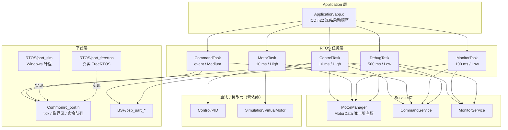
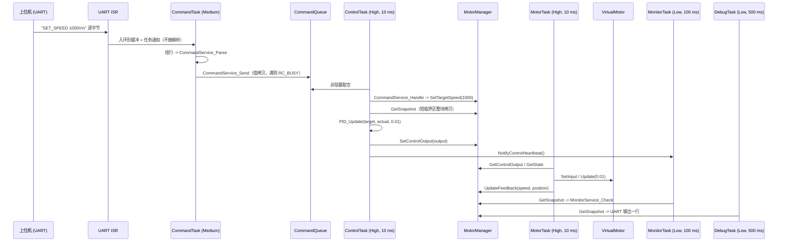
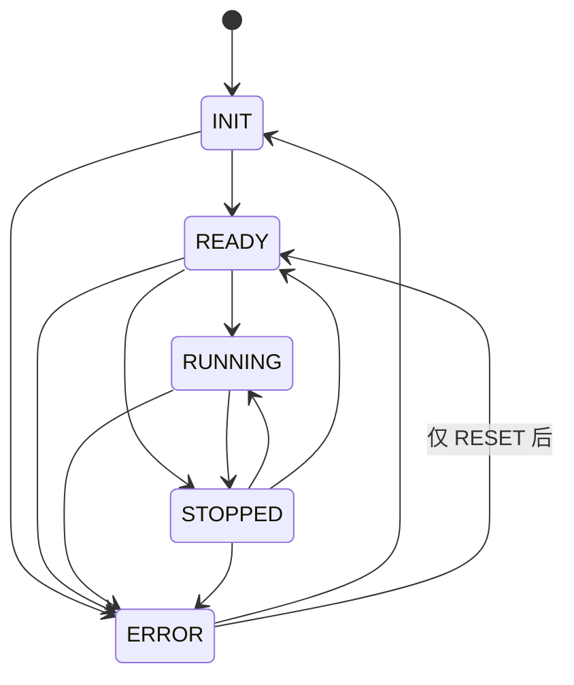

# RoboControl V1.0 架构说明

> 本文回答三个问题：**模块边界在哪、数据怎么流、并发为什么安全。**
> 每一条结论都给出代码里的落点，避免"文档写的和代码做的不一样"。

---

## 1. 分层与依赖方向



**依赖方向的铁律（ICD §23）：**

- 算法/模型层 **不依赖任何人** —— 这是它能在 PC 上单独测试的前提；
- Service 层只依赖 Common，**不 include FreeRTOS.h**；
- 任务层只能调用 Service/Control 的 API，**不得复制业务逻辑**（ICD §2 对 RTOS Tasks 的要求）；
- 平台差异被压缩进 `Common/rc_port.h` 声明的三个原语。

> 特别说明：ICD §4 要求 `MotorData.update_tick` 由 MotorManager 自动打时间戳，
> ICD §18 又允许它用短临界区，但 ICD §23 禁止它 include FreeRTOS.h。
> 三者直接冲突，解决办法是**依赖倒置**：Common 声明原语，平台层实现。
> 详见 `ICD_CHANGE_REQUEST.md` CR-005。

---

## 2. 端到端数据流（一次命令的完整旅程）



关键点：**命令的解析者和执行者是两个不同的任务**。
CommandTask 只负责"字符串 -> CommandMessage"，
ControlTask 负责"CommandMessage -> 系统动作"。
这带来两个好处：解析（可能慢、可能出错）不会落在 10 ms 周期里；
而且"谁碰 PID"这件事不需要靠约定 —— 只有 ControlTask 那个编译单元持有 PID 实例。

---

## 3. 并发与数据竞争

| 共享对象 | 谁能写 | 谁能读 | 同步手段 |
|---|---|---|---|
| `PIDController` | 仅 ControlTask | 仅 ControlTask | 不需要（独占，ICD §18 规则 1） |
| `VirtualMotor` | 仅 MotorTask | 仅 MotorTask | 不需要（独占，ICD §18 规则 2） |
| `CommandQueue` | CommandTask | ControlTask | FreeRTOS Queue（值拷贝） |
| `MotorData` | 经 MotorManager API | 经 MotorManager API | 标量原子；整块快照用短临界区 |

### 为什么只有快照需要临界区

在 ARMv7-M 上，**对齐的 32 位字访问是原子的**。`float`、`MotorState`（枚举=int）、
`uint32_t` 都是单字，因此标量的读写不需要任何锁。

`MotorData` 有 6 个字段，整块拷贝不是原子操作：
ControlTask 可能在 MotorTask 刚写完 `actual_speed`、
还没写完 `position` 的瞬间读走一份**自相矛盾**的快照。
所以只有 `MotorManager_GetSnapshot()` 使用短临界区，且临界区内只有赋值、没有任何阻塞调用
（ICD §18 规则 5 的明确要求）。

### 为什么禁止用 volatile 代替同步

`volatile` 只保证"不被优化掉、每次都真的访问内存"，
它**不提供原子性，也不提供顺序性**。用 volatile 保护多字段结构，
得到的是"看起来像同步、实际上随机出错"的代码 —— 比不加更危险。
本工程**没有使用任何 volatile 做同步**（ICD §18 规则 6）。

---

## 4. 任务时序

```
t(ms)   0    10   20   30  ...  100  ...  500  ...
        |    |    |    |          |         |
Control █    █    █    █          █         █      10 ms  PID + 输出提交
Motor   █    █    █    █          █         █      10 ms 模型更新 + 反馈回写
Command ▁▁▁▁▁▁▁▁▁▁▁▁▁▁▁▁▁▁▁▁▁▁▁▁▁▁▁▁▁▁▁▁▁▁▁▁▁▁▁ 事件驱动（阻塞在 UART 上）
Monitor ·    ·    ·    ·          █         ·      100 ms 健康检查
Debug   ·    ·    ·    ·          ·         █      500 ms 输出一行
```

- 1 ms tick 与 10 / 100 / 500 ms 周期**整除**，没有取整误差；
- Control 与 Motor **同为 High 优先级**（ICD §12 冻结表），由 FreeRTOS 时间片轮转；
- Command 是 Medium：解析不会抢占控制环；
- Monitor / Debug 是 Low：**观测永远不能影响实时性**。

### ControlTask 的一拍（ICD §13 的八步，代码逐条对应）

```c
vTaskDelayUntil(&last_wake, pdMS_TO_TICKS(RC_CONTROL_PERIOD_MS));   /* 1 */
while (RC_Port_CmdQueueReceive(&msg) == RC_OK) {                    /* 2 */
    CommandService_Handle(&msg);                                    /* 3 */
}
if (CommandService_TakePidResetRequest()) { PID_Reset(&s_pid); }    /* RESET */
snapshot = MotorManager_GetSnapshot();                              /* 4 */
output = (snapshot.state != MOTOR_RUNNING) ? 0.0f                    /* 5 */
       : PID_Update(&s_pid, snapshot.target_speed,                  /* 6 */
                    snapshot.actual_speed, RC_DEFAULT_DT);
(void)MotorManager_SetControlOutput(output);                        /* 7 */
MonitorService_NotifyControlHeartbeat();                            /* 8 */
```

---

## 5. 状态机（ICD §10 冻结）



**被禁止的转换**（非法一律返回 `RC_INVALID_PARAM`）：

- `RUNNING -> INIT`：运行中不允许直接回初始化；
- `ERROR -> RUNNING`：故障必须先被清掉；
- `INIT -> RUNNING`：未就绪不能直接开环。

**ERROR -> READY 是"仅 RESET 后"**，实现上不是靠注释，而是靠参数控制的可达性：
对外接口 `MotorManager_SetState()` 永远关闭这条通道，
只有 `MotorManager_RequestReset()` 能打开它。
测试里对这一条有专门的用例。

**RESET 的语义是"故障源消失才允许恢复"**：
如果反馈仍然没有更新，MonitorTask 会在下一个 100 ms 周期里重新判定并再次转 ERROR。
一次 RESET 就能让"没有反馈"的系统停在 READY，会立刻在现场养成
"按一下复位接着跑"的危险习惯 —— 保护不能被清标志位绕过。

---

## 6. 主机仿真为什么用纤程（fiber）

第一版仿真器是"单线程 + 直接调用任务函数"：调度器调用任务，
期望 `vTaskDelay` 返回后就等于任务让出了 CPU。**这是错的** ——
`vTaskDelay` 是一次普通函数调用，它 return 之后执行流还在任务自己的
`for(;;)` 循环里，于是任务永远回不到调度器，仿真时钟停在 `tick = 0`。

任务需要一个"能被挂起、之后还能从原处继续"的执行上下文，也就是协程。三个选项：

| 方案 | 结论 |
|---|---|
| 真实线程 + 严格乒乓交接 | 可行，但平台代码翻倍，且需要额外的确定性论证 |
| POSIX `ucontext` | MinGW 不提供，Windows 上不可用 |
| **Windows Fiber** | **采用**：单线程、显式切换、每个任务独立栈 |

纤程的三条性质正好是仿真需要的：

1. 同一时刻只有一个执行流在跑 → 结果完全确定、可逐拍复现；
2. 切换点只发生在任务自己调用的阻塞 API 上 → 语义等同于协作式调度；
3. 每个任务有独立栈 → 任务里的局部变量在阻塞前后正确存活，与真实 FreeRTOS 一致。

**已知边界**：协作式调度要求任务每轮至少阻塞一次。若某个任务不阻塞，
仿真会挂死。为此加了一个看门狗线程：20 秒无进展就打印
`FATAL: scheduler spin detected` 并退出码 2 ——
把"永远卡住"变成一条有时戳的报错，而不是让人对着黑屏猜。
